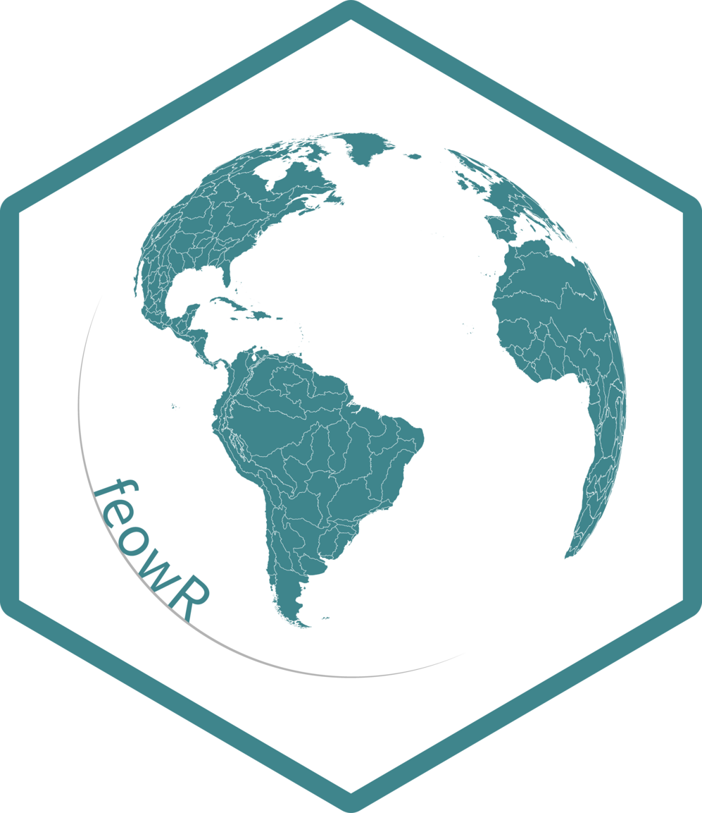

<!-- README.md is generated from README.Rmd. Please edit that file -->

```{r, include = FALSE}
knitr::opts_chunk$set(
  collapse = TRUE,
  comment = "#>",
  fig.path = "man/figures/README-",
  out.width = "100%"
)
```

# feowR <a href="https://brunomioto.github.io/feowR/"></a>


<!-- badges: start -->
[](https://app.codecov.io/gh/brunomioto/feowR?branch=master)
[](https://github.com/brunomioto/feowR/actions/workflows/R-CMD-check.yaml)
<!-- badges: end -->

**feowR** provides a faster and secure way to download shapefiles of [Freshwater Ecoregions of the World (FEOW)](https://feow.org) using [piggyback](https://docs.ropensci.org/piggyback/index.html) R package.

## Installation

You can install the development version of feowR from [GitHub](https://github.com/) with:

``` r
# install.packages("remotes")
remotes::install_github("brunomioto/feowR")
```

## Example

```{r example}
library(feowR)

feow_sf <- read_feow()
```

Now let's plot it!

```{r, dpi=600,warning=FALSE}
library(ggplot2)

ggplot(data = feow_sf)+
  geom_sf()
```

We can see the list of all ecoregions, from [FEOW website](https://www.feow.org/ecoregions/list)

```{r}
ecoregions_list
```


