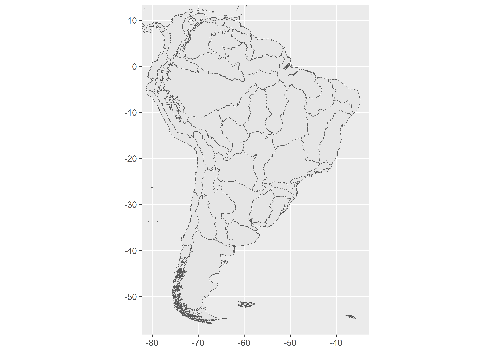

<!-- README.md is generated from README.Rmd. Please edit that file -->

# feowR

<!-- badges: start -->
<!-- badges: end -->

The goal of **feowR** is to download shapefiles of Freshwater Ecoregions
of the World (FEOW) inside R

## Installation

You can install the development version of feowR from
[GitHub](https://github.com/) with:

``` r
# install.packages("remotes")
remotes::install_github("brunomioto/feowR")
```

## Example

``` r
library(feowR)

feow_sf <- read_feow()
```

Now let’s plot it!

``` r
library(ggplot2)

ggplot(data = feow_sf)+
  geom_sf()
```


Look the Freshwater Ecoregions of South America!

``` r
ggplot(data = feow_sf)+
  geom_sf()+
  coord_sf(xlim = c(-80, -35),
           ylim = c(10,-55))
```


