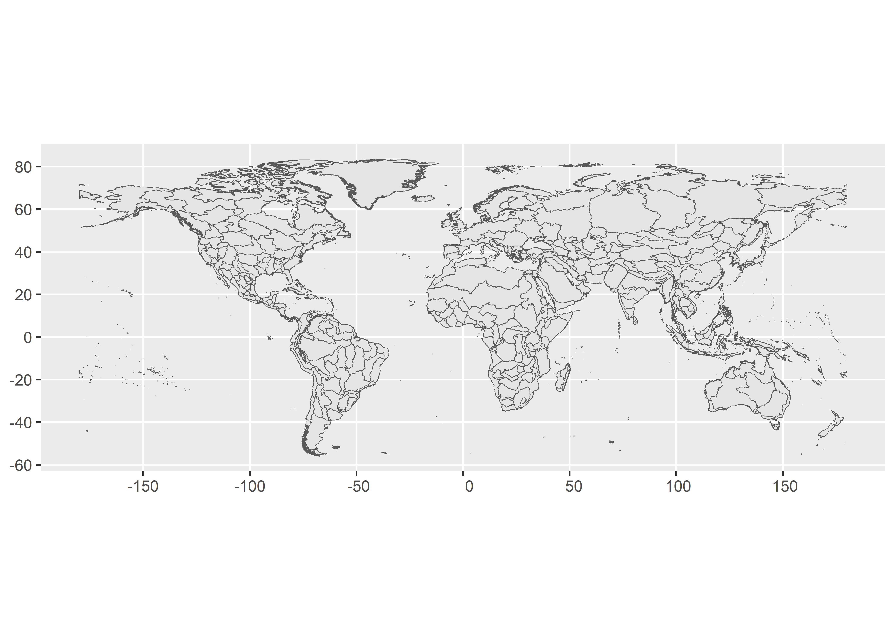

<!-- README.md is generated from README.Rmd. Please edit that file -->

# feowR <a href="https://brunomioto.github.io/feowR/"></a>

<!-- badges: start -->

[](https://app.codecov.io/gh/brunomioto/feowR?branch=master)
<!-- badges: end -->

The goal of **feowR** is to download shapefiles of Freshwater Ecoregions
of the World (FEOW) inside R

## Installation

You can install the development version of feowR from
[GitHub](https://github.com/) with:

``` r
# install.packages("remotes")
remotes::install_github("brunomioto/feowR")
```

## Example

``` r
library(feowR)

feow_sf <- read_feow()
```

Now let’s plot it!

``` r
library(ggplot2)

ggplot(data = feow_sf)+
  geom_sf()
```



We can see the list of all ecoregions, from [FEOW
website](https://www.feow.org/ecoregions/list)

``` r
ecoregions_list
#> # A tibble: 426 × 4
#>       id realm    major_habitat_type                       ecoregion            
#>    <int> <chr>    <chr>                                    <chr>                
#>  1   101 Nearctic Polar freshwaters                        Alaskan Coastal      
#>  2   102 Nearctic Polar freshwaters                        Upper Yukon          
#>  3   103 Nearctic Temperate coastal rivers                 Alaska & Canada Paci…
#>  4   104 Nearctic Temperate floodplain rivers and wetlands Upper Mackenzie      
#>  5   105 Nearctic Polar freshwaters                        Lower Mackenzie      
#>  6   106 Nearctic Polar freshwaters                        Central Arctic Coast…
#>  7   107 Nearctic Temperate upland rivers                  Upper Saskatchewan   
#>  8   108 Nearctic Temperate upland rivers                  Middle Saskatchewan  
#>  9   109 Nearctic Large lakes                              English - Winnipeg L…
#> 10   110 Nearctic Temperate coastal rivers                 Southern Hudson Bay  
#> # ℹ 416 more rows
```

Look the Freshwater Ecoregions of Neotropical region!

``` r
library(dplyr)

feow_sf |>
  left_join(ecoregions_list, by = join_by("FEOW_ID" == "id")) |>
  filter(realm == "Neotropic") |>
  ggplot()+
  geom_sf()
```


